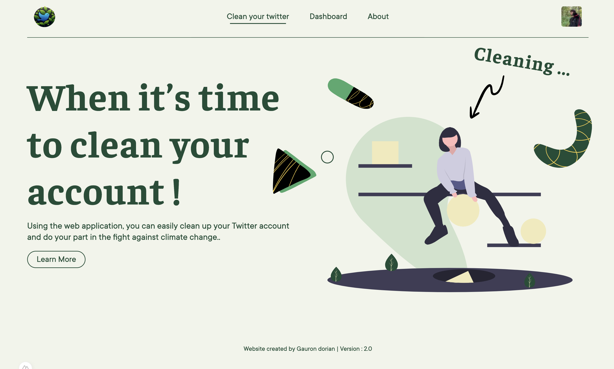

<div id="top"></div>


<!-- PROJECT LOGO -->
<br />
<div align="center">
    

<h3 align="center">Clean your tweeter</h3>

  <p align="center">You always wondering how to remove bunch of tweets ?</p>
    
</div>


 <br />  

<!-- TABLE OF CONTENTS -->
<details>
  <summary>Table of Contents</summary>
  <ol>
    <li>
      <a href="#about-the-project">🧭 About The Project</a>
      <ul>
        <li><a href="#built-with">🏗️ Built With</a></li>
      </ul>
    </li>
    <li>
      <a href="#getting-started">📋 Getting Started</a>
      <ul>
        <li><a href="#prerequisites">🗺️ Prerequisites</a></li>
        <li><a href="#installation">⚙️ Installation</a></li>
      </ul>
    </li>
    <li><a href="#usage">💾 Usage</a></li>
    <li><a href="#contributing">🔗 Contributing</a></li>
    <li><a href="#license">📰 License</a></li>
    <li><a href="#contact">📫 Contact</a></li>
    <li><a href="#acknowledgments">⛱️ Acknowledgments</a></li>
  </ol>
</details>

<br>


<!-- ABOUT THE PROJECT -->
## 🧭 About The Project

⚠️ Unfortunately, due to the Twitter API restrictions, the project is not working. Because with free trial you can only create tweet no more fetching  ⚠️

This project is a mono repository that contains a frontend and a backend. The goal is to create a web application that will allow you to delete your tweets in bulk. The backend is a native webserver golang application that will allow you to interact with the twitter API. The frontend is a nuxt application that will allow you to interact with the backend.

### 🏗️ Built With

List of technologies / frameworks used during the project.

* [Docker](https://www.docker.com/)
* [Heroku](https://www.heroku.com/)

#### Frontend

* [Nuxt](https://nuxtjs.org/)
* [Sass](https://sass-lang.com/)

#### Backend

* [Golang](https://golang.org/)
* [JWT](https://jwt.io/)
* [Mongo](https://www.mongodb.com/)

<p align="right"><a href="#top">⬆️</a></p>


<!-- GETTING STARTED -->
## 📋 Getting Started

It's easy to publish and create content online. But it's hard to keep it clean. This project will help you to clean your tweeter account. With api you can only delete tweets by x limit, so i added a cron that delete tweet if you excess limit.

### 🗺️ Prerequisites

The best way to deploy the project is to use docker and docker-compose. You will need to have docker and docker-compose installed on your machine.

Golang is also required to build the backend.
Node is required to build the frontend.

<p align="right"><a href="#top">⬆️</a></p>


<!-- USAGE EXAMPLES -->
## 💾 Usage

### Backend

Before running the project, you need to add a .env in the backend folder with the following content :

```shell
#Mongo
URI_MONGO=""

#Twitter
CLIENT_ID=""
SECRET_CLIENT_ID=""
REDIRECT_URI="Same as in twitter app"
CLIENT_URI="Same as in twitter app"
```

Then you can run the project with the following command (don't forget to be in the backend folder, and go mod tidy before running the project):

```shell
go run server.go
```

### Frontend

Before running the project, you need to add a .env in the backend folder with the following content :

```shell
NUXT_VERSION="2.0"
NUXT_API_ENDPOINT=""
NUXT_API_REDIRECT_URI=""
NUXT_API_WEBSOCKET=""
NUXT_TWITTER_CLIENT_ID=""
NUXT_TWITTER_CODE_CHALLENGE=""
```

Then you can run the project with the following command (don't forget to be in the frontend folder):

```shell
pnpm run dev
```


<p align="right"><a href="#top">⬆️</a></p>


<!-- CONTRIBUTING -->
## 🔗 Contributing

Contributions are what make the open source community such an amazing place to learn, inspire, and create. Any contributions you make are **greatly appreciated**.

If you have a suggestion that would make this better, please fork the repo and create a pull request. You can also simply open an issue with the tag "enhancement".
Don't forget to give the project a star! Thanks again!

1. Fork the Project
2. Create your Feature Branch (`git checkout -b feature/AmazingFeature`)
3. Commit your Changes (`git commit -m 'Add some AmazingFeature'`)
4. Push to the Branch (`git push origin feature/AmazingFeature`)
5. Open a Pull Request

<p align="right"><a href="#top">⬆️</a></p>


<!-- LICENSE -->
## 📰 License

Distributed under the MIT License. See `LICENSE.txt` for more information.

<p align="right"><a href="#top">⬆️</a></p>


<!-- CONTACT -->
## 📫 Contact

Reach me at : gauron.dorian.pro@gmail.com.

Project Link: [https://github.com/Michelprogram/magic-scanner.git](https://github.com/Michelprogram/magic-scanner.git)

<p align="right"><a href="#top">⬆️</a></p>


<!-- ACKNOWLEDGMENTS -->
## ⛱️ Acknowledgments

This space is a list to resources i found helpful and would like to give credit to.

* [Nuxt](https://nuxtjs.org/)
* [Golang](https://golang.org/)
* [JWT](https://medium.com/@cheickzida/golang-implementing-jwt-token-authentication-bba9bfd84d60)
  
<p align="right"><a href="#top">⬆️</a></p>

<a href="https://github.com/othneildrew/Best-README-Template">Template inspired by othneildrew</a>
